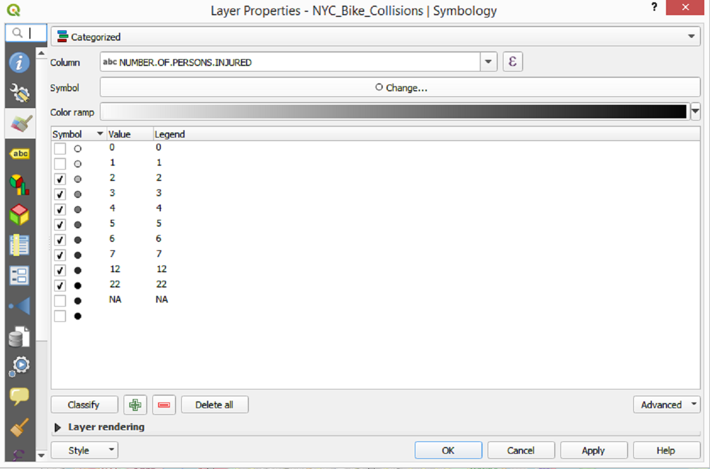
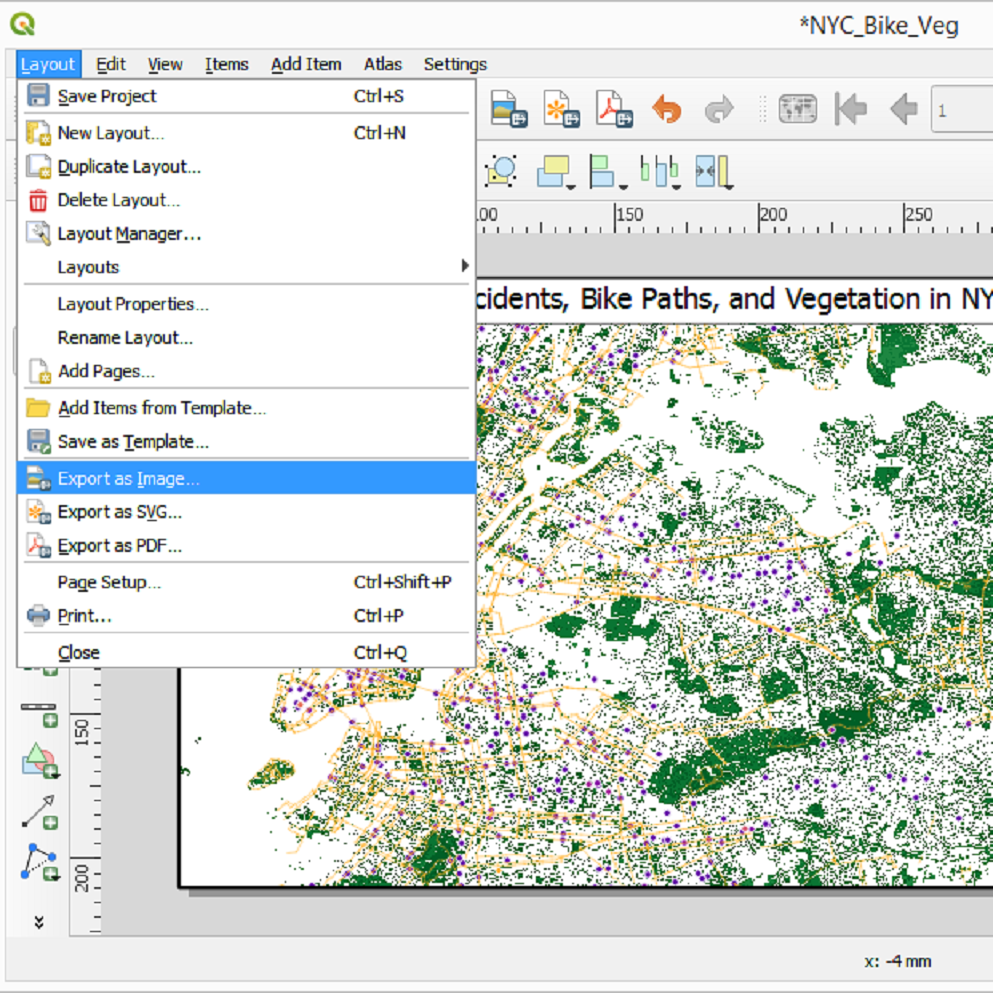

# Intro to QGIS

### Contents:

[Downloading QGIS and Other Links](https://github.com/AaronScherf/Basic_Spatial_Visualization/blob/master/Intro_QGIS/Guide.md#downloading-qgis-and-other-links) 

[QGIS Environment](https://github.com/AaronScherf/Basic_Spatial_Visualization/blob/master/Intro_QGIS/Guide.md#qgis-environment)

[Spatial Vector Data](https://github.com/AaronScherf/Basic_Spatial_Visualization/blob/master/Intro_QGIS/Guide.md#spatial-vector-data)

[Basemaps using QuickMapServices Plugin](https://github.com/AaronScherf/Basic_Spatial_Visualization/blob/master/Intro_QGIS/Guide.md#basemaps-using-quickmapservices-plugin)

[Spatial Coordinate Data](https://github.com/AaronScherf/Basic_Spatial_Visualization/blob/master/Intro_QGIS/Guide.md#spatial-coordinate-data)

[Importing Non-Spatial Data & Joining Data](https://github.com/AaronScherf/Basic_Spatial_Visualization/blob/master/Intro_QGIS/Guide.md#importing-non-spatial-data--joining-data)

[Raster Image Data](https://github.com/AaronScherf/Basic_Spatial_Visualization/blob/master/Intro_QGIS/Guide.md#raster-image-data)

[More Fun Options](https://github.com/AaronScherf/Basic_Spatial_Visualization/blob/master/Intro_QGIS/Guide.md#more-fun-options)

[Exporting Maps](https://github.com/AaronScherf/Basic_Spatial_Visualization/blob/master/Intro_QGIS/Guide.md#exporting-maps)

## The Data: NYC Census, Bike, and Forest Data {#the-data-nyc-census-bike-and-forest-data}

<table>
  <tr>
   <td>Data Title
   </td>
   <td>Filename
   </td>
   <td>Description
   </td>
   <td>Source
   </td>
  </tr>
  <tr>
   <td>NY Demographics
   </td>
   <td>NYC_ACS_Data_Perc.csv
   </td>
   <td>Population characteristics by Census Block Group 2017
   </td>
   <td><a href="https://factfinder.census.gov/faces/nav/jsf/pages/index.xhtml">American Community Survey 2017 5-Year</a>
   </td>
  </tr>
  <tr>
   <td>NY Demographics Variable Format
   </td>
   <td>NYC_ACS_Data_Perc.csvt
   </td>
   <td>Support file for NY Demographics
   </td>
   <td>Created by Author
   </td>
  </tr>
  <tr>
   <td>NYC Bike Collisions
   </td>
   <td>NYC_Bike_Collisions.csv
   </td>
   <td>Bicycle accidents in NYC by NYPD 2019
   </td>
   <td><a href="https://data.cityofnewyork.us/Public-Safety/NYPD-Motor-Vehicle-Collisions/h9gi-nx95">NYC Open Data</a>
   </td>
  </tr>
  <tr>
   <td>NYC Vegetation Landcover Raster
   </td>
   <td>Sat_Image \ landcover_2010_nyc_3ft.img
   </td>
   <td>3 Foot Raster Image of Land Cover in NYC 2010
   </td>
   <td><a href="https://data.cityofnewyork.us/Environment/Landcover-Raster-Data-2010-3ft-Resolution/9auy-76zt">NYC Open Data</a>
   </td>
  </tr>
  <tr>
   <td>NY Census Block Groups Shapefile
   </td>
   <td>CBG_2017 \ cb_2017_36_bg_500k.shp
   </td>
   <td>Boundaries of Census Block Groups in NY 2017
   </td>
   <td><a href="https://www.census.gov/geo/maps-data/data/cbf/cbf_blkgrp.html">US Census Boundaries</a>
   </td>
  </tr>
  <tr>
   <td>NYC Bike Paths
   </td>
   <td>Bicycle_Routes \ Bike_Paths_NYC.shp
   </td>
   <td>Polygons of Bicycle Routes in NYC 2017-2019
   </td>
   <td><a href="https://data.cityofnewyork.us/Transportation/Bicycle-Routes/7vsa-caz7">NYC Open Data</a>
   </td>
  </tr>
  <tr>
   <td>NYC Bicycle Parking
   </td>
   <td>Bike_Parking_2013 \ city_racks_2013_06_28.shp
   </td>
   <td>CityRack Bike Parking Locations NYC 2013
   </td>
   <td><a href="https://data.cityofnewyork.us/Transportation/Bicycle-Parking/qpbf-g2yx">NYC Open Data</a>
   </td>
  </tr>
</table>

For this seminar, we will use a variety of different datasets concerned with bicycles, land cover, and census demographics for New York City. This data was chosen because NYC has a fantastic repository of open source data available for free online. The remaining data was downloaded from the Census Bureau website, particularly the American Factfinder, where both decennial Census data and American Community Survey (ACS) data is available free for download (see links above).

To follow along with this guide, [download the repository on GitHub here](https://github.com/AaronScherf/Basic_Spatial_Visualization) as a .zip folder. Then unzip the folder to a destination on your hard drive (then delete everything but the NYC_Data folder if you'd like). The folder should contain 4 files in the main directory and 4 sub-folders, with a variety of files in each sub-folder. The relevant files are described in the table above. Other files, particularly for spatial data, are "support files" which help programs import the main file of interest.

---

## Downloading QGIS and Other Links

*   [Downloading QGIS 3.4 (FREE)](https://qgis.org/en/site/forusers/download.html)
    *   Get Version 3.4 to Use All Plugins!
    
*   [Resources for Learning QGIS - Data Scholars Discovery Guide](https://data-scholars-discovery.github.io/contents/qgis)
*   [Udemy: Learn to Use QGIS](https://www.udemy.com/draft/149366/)
*   [GIS at Tufts: QGIS Guide](https://sites.tufts.edu/gis/quantum-gis-qgis-tutorials-tip-sheets/)

## QGIS Environment

QGIS has become the leading standard in open source spatial data software. Its primary functions are importing, manipulating, and visualizing geographic data, though it also has useful tools for connecting non-spatial data and performing simple analysis. It has a standard, photoshop-style user interface based on layers of data displayed in a visualization window, with a host of tools and settings in the bars at the top.

There are many options for customizing the QGIS environment, but the main addition that I prefer is the "Manage Layers Toolbar". You can activate it in the View -> Toolbars dropdown.

---

## Spatial Vector Data

The primary type of spatial data which you can work with is vector files. These are often traditional [shapefiles](https://en.wikipedia.org/wiki/Shapefile), a designation created by [Esri ](https://en.wikipedia.org/wiki/Esri)(the folks behind ArcGIS), but can also include [Keyhole Markup Language](https://en.wikipedia.org/wiki/Keyhole_Markup_Language) (KML) and KMZ (zipped KML) file types. Fundamentally they are all collections of coordinates organized into shapes (points, lines, and polygons). These shapes are often coded with unique identifiers connected to numeric, text, or logical data variables. Shapefiles are almost always associated with a database support file, which QGIS can import with the geometry as an associated data table, much like a CSV file.

First, let's bring in a shapefile of all census block groups in the state of New York using the "Add Vector Layer" button in our Manage Layers Toolbar.

This brings up the Data Source Manager opened to the Vector tab. You can browse for a vector dataset using the button with an ellipse "..." next to the filepath bar.

After browsing to the "CBG_2017" folder, select the shapefile "cb_2017_36_bg_500k.shp". Note that shapefiles use the .shp file format, while the various support files associated with them can often include similar formats like .shx. Ensure that you select the type "SHP File".

After you successfully import the shapefile you should see the state of New York, divided by census block groups, as below. The color is selected randomly so don't worry if it isn't yellow.

If you want to see the data variables associated with the shapefile, you can open the browse window at the top right, clicking the button "Open Attribute Table", shortcut F6.

---

## Basemaps using QuickMapServices Plugin

Most maps include some form of base layer, usually a map of political boundaries or satellite imagery. These can be tiresome to find and download online for your specific map extent. Programmers, being lazy, have thus developed packages to automatically download and import a base layer. These user created packages are maintained by volunteers and as such can be out of date for newer versions of QGIS, but most "stable builds" have a full suite of packages for baselayers. If you are using version 3.4 or below you should have access to the QuickMapServices (QMS) plugin, which hosts maps made by the [Open Street Map](https://www.openstreetmap.org/) (OSM) project, one of the largest open source mapping projects in the world.

To access the QMS plugin, click on the Plugins dropdown and then "Manage and Install Plugins…" to open the Plugins window.

Search for "QuickMapServices" in the top bar and install to your computer.

From there, to use the plugin just select the "Web" dropdown menu, then QuickMapServices, followed by OSM (the other map options are incomplete, possibly waiting on updates to the package--the price of open source software). I like the OSM Standard map.

---

## Spatial Coordinate Data

Another important type of spatial data is coordinate points. These are also stored as vectors, technically, but we import them most often from delimited text files (CSV's). If your data already contains columns for latitude and longitude, QGIS will automatically treat it as spatial data and assign it to the proper coordinate points (as determined by your project's coordinate reference system).

After clicking on "Add Delimited Text Layer", select the "NYC_Bike_Collisions.csv" file using the browse button (...) next to File Name.

Once you have selected the CSV, QGIS will automatically assign the LONGITUDE variable to the x-field and the LATITUDE variable to the y-field within Geometry definitions. The CRM should automatically choose your project coordinate reference, as set by the shapefile we imported earlier.

Click "Add" and then "Close" if the window doesn't disappear automatically. You should see a whole lot of dots added to your map right around New York City, as below.

Note that they appear over the census block group shapefile by default, as they are the top layer in the "Layers" window. You can click and drag layers to change their order.

To inspect the data attributes inside of our CSV file of coordinate points, you can open the Attribute Table with the button next to the abacus in the top right. For those Gen-Z's who don't know what an [abacus](https://en.wikipedia.org/wiki/Abacus) is, it was basically the original machine learning app.

The attribute table shows our data in a typical row-column format, with columns representing variables and rows observations. You see our lat-long coordinates as well as a host of data on reported bike accidents in New York City. We can use these attributes to select, filter, sort, and style our data on the map. You can also edit data directly in QGIS in the editor mode.

Our bike accidents are very dense and jumbled, not to mention an ugly brown color. Let's change them to visually represent the number of people involved in the accident, then filter out "minor" accidents that resulted in less than 2 persons injured. First, right click the layer and select the "Properties…" button.

This opens the "Layer Properties" window for this layer, starting on the Symbology tab. Here you can adjust the size, color, shape, and other options that affect how your data appears in the map visualization. Select the dropdown bar that says "Single symbol".

You'll find several options for representing your data, including special options for point data such as "Point displacement", "Point cluster", and "Heatmap". We'll choose "Categorized", since we want to color the data by a numeric variable with a small range of values. "Graduated" would work as well but we will see that Categorized works best for our data.

In the Symbology window we now have the option to set the properties of our points by a variable in our CSV. Use the dropdown to choose "NUMBER.OF.PERSONS.INJURED". Note that it is formatted as text data, not numeric as we might expect. This would cause a problem with graduated colors, since text doesn't recognize numeric hierarchies (1 < 2 < 3).

Once you've selected the variable, choose the Color ramp. I went with Grays, but there are a lot of options depending on your preference and other map elements. Grays may have been a mistake, however, since our OSM base layer uses gray for non-vegetative area in cities.

If your data isn't automatically pulled in to the main Symbology window, click "Classify" at the bottom left. If you want to change variables you can "Delete all" of your colorings, or select individual values to delete. You should see a set of  numbers from 0 to 22, ordered alphabetically (since it is formatted as text data), plus an "NA" and a blank value. They should be colored on a white-black grayscale, with the first value alphabetically being 0 (numbers come before letters). Since we want to represent "worse" accidents as darker, we'll re-arrange our order and change the colors to fit our needs.

Click and drag the 12 and 22 values to the bottom of your list, between 7 and NA. Then right click on the individual classification values and choose the "Change Color" dropdown.

This pulls up the "Change Symbol Color" window, with a color scale selector that will be familiar to anyone that has used image editing software like Photoshop, including an HTML notation. Let's make 12 and 22 sufficiently dark to reflect their ordering in our grayscale, using "OK" to apply the color change. Then, deselect NA and the blank values to hide them from our map. Hit "OK" in the Symbology window to apply changes and close the window.

We still have a lot of points on our map, most of them with values of 0 or 1. Let's pretend we aren't interested in these values, since we want to investigate more serious bicycle accidents. You can deselect values directly in the layers window of the main interface by clicking on the dropdown arrow next to your layer and unchecking the box next to them. Deselect the 0 and 1 values.

That's better but it still doesn't tell us much. Let's deselect our census block group shapefile to see the points overlaid directly on the OSM baselayer. Then zoom in on Manhattan.

Much better! Now we can start to see some clustering of points. Reassuringly, they are also mostly situated on roads, rather than in the middle of water, so it seems our CRM's line up. The points look good close up but zoomed out they start to crowd together. What if we wanted to change the size of the coordinate point so that it scales with our map? Open the Symbology window again and click "Change" in the Symbol bar.

In the Symbol Selector window, click on the "Unit" dropdown where it is currently set to "Millimeter". Change to "Points" and then adjust the Size to 5. You can also adjust the opacity--let's set it to 70%. Apply and close the window with "OK".

	

Not too bad, but again the gray of the base layermakes it somewhat difficult to see. Let's try another color. I like the Plasma color scale, just because it sounds cool.

Feel free to experiment with different color and size options to see what you like best! There is no one right answer for maps, just whatever artistic elements convey your information.

---

## Importing Non-Spatial Data & Joining Data

One key feature of QGIS is its ability to import non-spatial data and join (merge or connect) it to spatial data layers. We can bring in a CSV file with no coordinates or geometry with the same "Add Delimited Text Layer" button as before.

Let's select the "NYC_ACS_Data_Perc.csv" to bring in our census demographics data.

This time make sure that "No geometry (attribute only table)" is selected under the Geometry definition options in the Data Source Manager window. Click "Add" and "Close".

The map didn't change but you have a new layer. Let's join our ACS data to the census block group shapefile (make sure it is selected again, and deselect the bike collision data). Right click the layer and go to "Properties".

Select the blue sideways triangle on the left of Layer Properties to open the Joins window.

The critical thing with joining data is to ensure that you have a unique ID variable in both datasets with the same values. This links observations from both data sources so that the data matches up. You don't need perfect 1-1 matches. QGIS defaults to a "left-sided" join, in which the shapefile determines the observations and any matches are brought in from the "Join layer". Since there are no geometries associated with the "Join layer", as it's just a CSV with no coordinates, it won't bring in data for which there aren't observations in the shapefile.

Select the "NYC_ACS_Data_Perc" as the Join layer, then choose the "Join field" as "Id". This is the ID variable from our CSV. Then select AFFGEOID for the "Target field". This is our ID from the shapefile. Now just click "OK" and wait for the data join to complete.

Now your census block group shapefile will have data from the ACS CSV layer available for your map visualization!

Jump over to the Symbology tab to change our census block group map colors. Let's make a pseudo-heatmap representing the percentage of each area responding as white.

Use the style type dropdown to select the "Graduated" option.

Note how the options changed from the coordinate points layer. No heatmap or point based options, but we have "Inverted polygons" and "2.5 D". Again these are more advanced, so let's stick with graduated color maps.

Select the "NYC_ACS_Data_Perc_Race_White_Perc" variable, which is formatted as a "double" or numeric variable. You can see that the name of the CSV file precedes the variables that were brought in from that layer, so you can tell them apart from the original shapefile variables.

Choose a color ramp option. I went with white to red but feel free to try something different. In order to see the values that will eventually form your legend, you need to "Classify" them. You have several options with numeric variables on how to split the continuum of values. "Equal interval", "Quantile (Equal Count)", "Natural Breaks (Jenks)", "Standard Deviation", and "Pretty Breaks". I chose Quantiles for interpretability; since the "Classes" option is set to 5 it will automatically break the data values into quintiles.

After selecting the Mode, hit Classify to see the values and colors associated with them in the Classes window.

Hit OK to apply the changes and return to your map.

Not bad, but the relatively small size of some census block groups is obscuring our data with the black border lines. Let's set them to transparent so we can visualize our fine grain data.

Return to our Symbology window and select the "Change…" button next to "Symbol".

There is a very subtle difference in QGIS between the "Fill" and "Simple fill" dropdown options in the Symbol Selector. Choose "Simple fill" to pull up the detailed menu of symbol properties, including the border or "Stroke color". It's currently set to black. Use the dropdown arrow on the right to pull up the quick style adjustor.

At the top of the menu, choose "Transparent stroke".

You will see the gray and white checkerboard pattern of transparent or "alpha" background in the "Stroke color" option.

Hit OK to apply the changes and return to your map.

Much better! Now we can visualize the percentage of white residents in each census block group at a good level of detail, even at this level of zoom. The red is a good constrast for the blue of the water. Let's bring our bicycle collision dots back onto our map view.

Can you discern any patterns about the spatial relationship between bike accidents and concentration of white residents? If so, do you think it may be significant? It's hard to test hypotheses with just visualizations. You can do spatial analysis between layers to answer questions like these but those methods are beyond the scope of this simple introduction.

---

## Raster Image Data

The final form of data we'll cover in this intro is raster files. These are basically image files with associated geometry, usually composed of satellite imagery. There is a whole lot of science behind satellite imaging but for our purposes we just need to know that raster images record light bouncing off the Earth into space. This light can be in the visible wavelength (like a Google Earth map) or in non-visible wavelengths (like infrared). Different wavelengths can be useful for identifying particular objects or "classes" of land (or water).

Our raster data uses an infrared wavelength to help identify various types of vegetation. To bring it into our map, click on the checkerboard "Add Raster Layer" button.

This pulls up the Data Source Manager again, with two source type options: "File" or "Protocol". The latter is for online hosted data from a website or cloud server. The former is for files on your own machine, which is what we will choose.

Use the browse button (...) to select the "landcover_2010_nyc_3ft" file from the "Sat_Image" folder. It's very important to select the "Disc Image File" type, not the Microsoft InfoPath file that also has the .img extension in the name. Raster layers, like shapefiles, often come with associated database files. Our file is the largest (118 KB or so), which is often the case. Raster files can be really large, particularly at finer resolutions.

Click "Open" to bring the layer into the map. You'll see a really bizare image that looks like colorful TV static on a black background.

This isn't an error. The infrared light has been separated into 15 values and each associated with a random color. 0 is for water or areas outside of the map, which is currently set as black. All of the other values are set at some random red, blue, green, etc.

To classify our vegetation satellite data in a more visually appealing way let's use a white-green color ramp. Go into the Symbology window and use the Color ramp drop down to select "Greens". You'll notice there is no option to select on variables, just "Band" values, which refer to the light spectrum represented in the raster data.

To make our data represent "more green, more vegetation", use the "Invert Color Ramp" option.

Now 0 should be the darkest green, with subsequent values fading to white. Since 0 is our water and blank data, let's change it to transparent. Right click to select "Change Opacity…"

Set the opacity percentage to 0% and hit "OK".

Now our raster data looks more like vegetation! Notice central park is more green than other areas. Yet intuition tells me that there is a lot of concrete in NYC that is currently styled as green in our raster layer.

Go back to the Symbology window and set values 4 through 15 to transparent. You can select multiple layers by selecting 4, holding shift, and then selecting 15. Right click them and change the opacity to 0% again.

Now we have a more convincing map of just vegetation. Zooming in on Central Park confirms our values--even the lake and walking paths are visible. The resolution of the raster is key here. Since we used 3 foot resolution, that means each pixel is a 3 foot square, allowing us to differentiate trees from the path or grass nearby. Less fine grain resolution can't do that, while finer grain can identify sections of individual trees!

Zoom in to check out how cool our raster layer is!

---

## More Fun Options

Select the bike collisions layer again to show the coordinate points on top of our raster layer and basemap. You can change the outside border of the points as well using the Symbology and Stroke color option. I set it to transparent and raised the opacity to 90%.

You can also try adding in the bike paths shapefile without the basemap. I liked it orange with 100% opacity and 0.8 points width options. Try it yourself!

---

## Exporting Maps

Having a cool map in QGIS is fun, but most of us are interested in sharing our maps with others. For that you typically want to export your map as an image or PDF file rather than a QGIS file (unfortunately not everyone has QGIS readily available). Use the Project dropdown on the top left and select the Import/Export tab to select "Export Map to Image…"

This pulls up the "Save Map as Image" window with a lot of options on map extent, scale, resolution, and output dimensions. If you want a larger map or a higher resolution you can adjust these, but the default works well for us. You can also copy this image directly to the clipboard to paste it into a document or PowerPoint. Click "Save" to save the image file.

Your resulting output will match the current view from the QGIS window, layers and all!

You can also add more details to your map export using a Print Layout editor. From the Project dropdown select "New Print Layout", shortcut Control+P.

Title your print layout according to your current map view and select "OK".

This pulls up the Print Layout Editor, which functions a lot like PhotoShop or Paint, with additional options to bring in our current map view, add legends, titles, shapes, and more!

Let's start by adding our map as the base of our print layout image.

Click the scroll with a green plus sign on the left to "Add a new Map to the layout". Select the area on your print layout screen that you want the map to fit to. I used the entire expanse of the canvas.

Our map is brought in as an Item with plenty of associated settings on its location and appearance. As of now this is the same as exporting as an image, so let's add a legend.

We can designate the area for the legend on our map the same way we brought in the base map layer. You can adjust the legend items in the options dropdown menu on the right to select only the map items you care about. Here we only want the bike paths and collisions.

You can also add a title to your map and adjust the font using the text editor. Try out different options for yourself and see if you can recreate the map below!

Once you are happy with your Print Layout, use the Layout dropdown to "Export as Image" the same way we did before.

Viola, you have a beautiful map with a title and legend!

